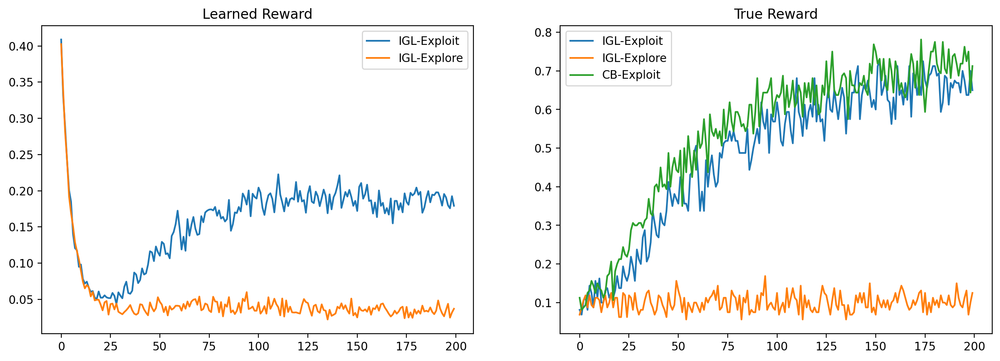

# Interaction Grounded Learning

This repository contains a simple PyTorch implementation of the ideas presented in the paper [Interaction Grounded Learning](https://arxiv.org/abs/2106.04887) (IGL) from Xie et al., 2021.

In IGL, rather than being provided with a reward signal from the environment, a feedback signal is provided instead which corresponds in some way to the true latent reward. The task is to learn both a policy for optimizing against the true reward, as well as a decoder for learning a proxy reward from the feedback signal.

My implementation differs slightly from that of the original paper, but converges consistently on the MNIST digit identification task, and is robust to hyperparameters and initialization seeds. Performance of IGL method is comparable to that of contextual bandit with access to ground truth reward.

The code can be found in the Jupyter notebook [here](./learn.ipynb).

## Requirements

* Python 3
* PyTorch
* TorchVision
* PyPlot
* Jupyter-Lab
